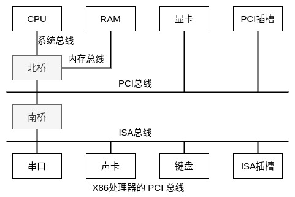

### 地址的本质

CPU 与内存、各种外部设备等 IP 之间都是通过总线相连的。在一个计算机系统中，CPU 内部的寄存器是没有地址的，可直接通过寄存器名访问。而内存和外部设备控制器中的寄存器都需要有一个地址，然后 CPU 才能通过地址去读写这些外部设备控制器的寄存器，控制外部设备的运行，或者根据地址去读写指定的内存单元。

内存中包含很多存储单元，为了方便管理，将这些存储单元进行编号，每个存储单元对应一个编号。当 CPU 想访问其中一个存储单元时，可通过 CPU 管脚发出一组信号，经过译码器译码，选中与这个信号对应的存储单元，然后就可以直接读写这块内存了。CPU 管脚发出的这组信号，也就是存储单元对应的编号，即地址。

地址的本质其实就是由 CPU 管脚发出的一组地址控制信号。因为这些信号是由 CPU 管脚直接发出的，因此也被称为`物理地址`。地址信号的位数决定了寻址空间的大小，在一个 32 位的计算机系统中，32 位的地址线有 4GB 大小的寻址空间。

在带有 MMU(内存管理单元)的 CPU 平台下，程序运行一般使用的是虚拟地址，MMU 会把虚拟地址转换为物理地址，然后通过 CPU 管脚发送出去，地址信号通过译码，选中指定的内存存储单元，再进行读写操作。

### 总线的概念

现在的计算机系统中 CPU 一般都是通过总线与内存 RAM、外部设备相连的。CPU 处理器和北桥通过系统总线连接，内存 RAM 和北桥通过内存总线连接，CPU 和各个设备之间可以通过共享总线的方式进行通信。如下图所示。

总线其实就是各种数字信号的集合，包括地址信号、数据信号、控制信号等。有的总线还可以为挂到总线上的设备提供电源。一个计算机系统中可能会有各种不同的总线，不同的总线读写时序、工作频率不一样，不同的总线之间通过桥(bridge)来连接。桥一般是一个芯片组电路，用来将总线的电子信号翻译成另一种总线的电子信号。比如北桥用来将 CPU 从系统总线发过来的电子信号转换成内存能识别的内存总线信号，或者显卡能识别的 PCI 总线信号，进而完成后续的数据传输和读写过程。通过遵循相同的总线协议和通信标准，可以将不同的设备，如显卡、鼠标、键盘等方便地添加到计算机系统中。

### 总线编址方式

对内存 RAM 和外部设备的编址，计算机一般有两种方式: 统一编址和独立编址。

统一编址就是内存 RAM 和外部设备共享 CPU 的寻址空间，ARM、MIPS 架构的 CPU 都采用这种编址方式。在这种模式下，内存 RAM、外部设备控制器的寄存器、集成在外部设备控制器内部的 RAM 共享 CPU 的寻址空间，CPU 可以像操作内存一样去读写外部设备的寄存器和内部 RAM。

在独立编址模式下，内存 RAM 和外部设备的寄存器独立编址，分别占用不同的地址空间。如 X86 架构的 CPU，外部设备的寄存器有独立的 64KB 空间，需要专门的 IN/OUT 指令才能访问，这片独立编址的 64KB 大小的空间也被称为 I/O 地址空间。
