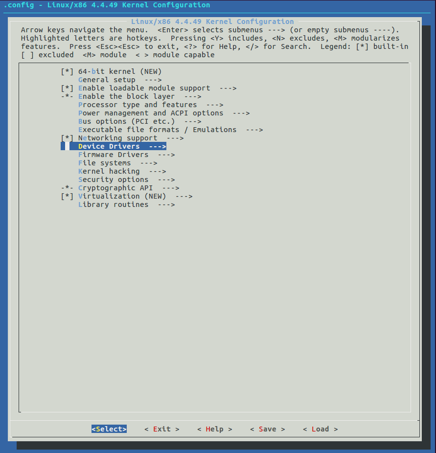

注: 如果没有特别说明，本文件中的命令均在文件顶层目录下执行。

### 内核配置文件

在执行内核编译之前，需要在顶层目录下创建一个 .config 文件。顶层 Makefile 会使用这个 .config 文件来构建内核。

大多数内核软件模块也通过 .config 文件间接地读取配置内容，原理如下:

在构建过程中，构建系统会处理这个 .config 文件，并生成一个名为 autoconf.h 的C语言头文件，放在目录 include/linux 中，这个文件是自动生成的。尽量不要直接修改这个文件，因为当配置有变动并且新的构建开始后，你所做的修改就丢失了。很多内核源文件直接使用预处理指令 #include 来包含这个文件。

从 Makefile 的角度:
- obj-y 表示静态编译进内核
- obj-m 表示动态编译进内核，即模块
在 auto.conf 中看到的都是这样的配置项。

内核构建文件在每条内核编译命令行中都包含了这个 autoconf.h 文件，具体是使用了编译命令 gcc 的-include选项，如下所示:
```s
  gcc ... –include include/linux/autoconf.h … <somefile.c>
```
各个内核模块就是通过这种方式来访问内核配置的。

子目录 arch 下包含该版本 linux 支持的各种架构。以 x86 为例，进入 arch/x86/configs 目录下，其包含以下文件:
```s
  i386_defconfig  kvm_guest.config  tiny.config  x86_64_defconfig  xen.config
```
这些都是 x86 所提供的不同种类的配置文件。开发者可以使用这里面的配置进行编译。

当然，开发者也可以在上面默认的配置文件的基础上进行微调。如下:
```s
  make menuconfig
```
会出现如下界面:



开发者可以使用方向键来选择条目，使用空格键来选择某个条目具体选项。

完成后保存退出，选择的内容会即时更新到全局配置文件 .config 中。

### 内核的产物

内核文件的产物名称如下:
- vmlinux: 原始的，未经压缩的内核可执行文件
- zImage: 压缩过的可执行文件——压缩 vmlinux 后，加上一个 head part(用来解压)
- uImage: 用于给 uboot 引导的zImage
- bzImage: 即 bigzImage，通过 gzip 压缩的

### 编译 Linux 内核

以 x86 示例，如下:
```s
  cp -a arch/x86/configs/x86_64_defconfig .
  make ARCH=x86 -j8
```
编译结束以后，在顶层目录下会生成一个 vmlinux 文件即是。
